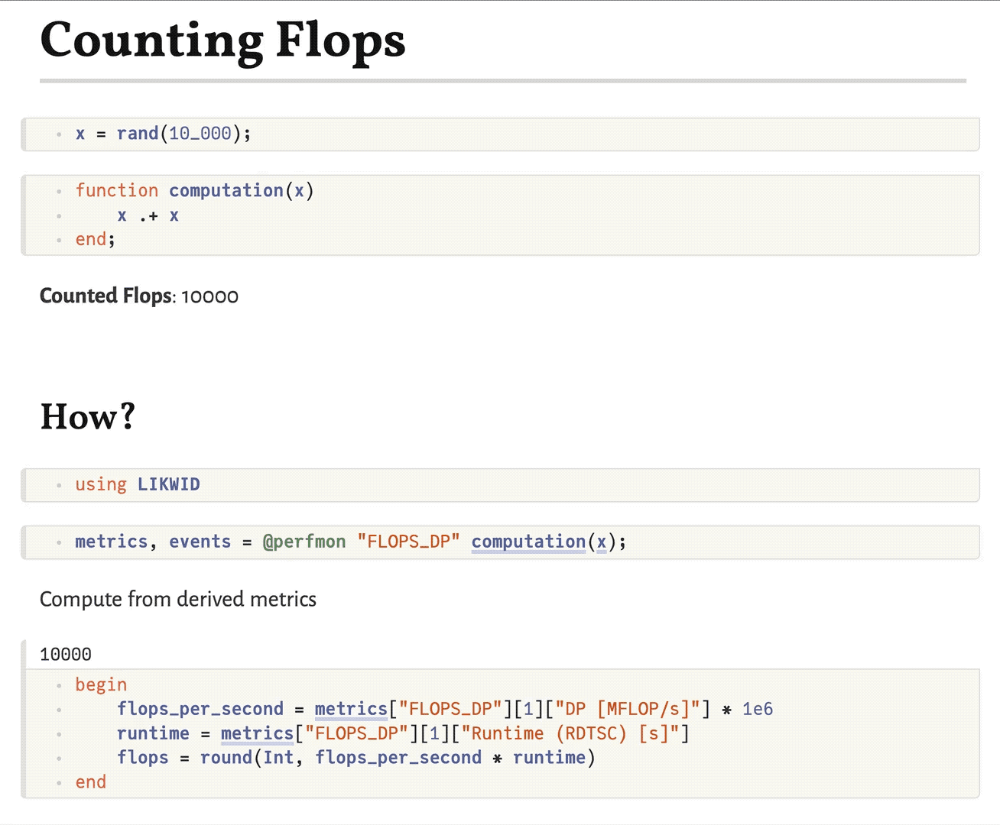

```@meta
EditURL = "https://github.com/JuliaPerf/LIKWID.jl/blob/main/docs/src/tutorials/counting_flops.jl"
```

# Counting FLOPs

Have you ever wondered how many floating point operations (FLOPs) a certain block of code,
e.g. a Julia function, has *actually* triggered in a CPU core? With LIKWID.jl you can readily
answer this question!

Let's consider a simple example: [SAXPY](https://www.netlib.org/lapack/explore-html/df/d28/group__single__blas__level1_gad2a52de0e32a6fc111931ece9b39726c.html).
The abbreviation SAXPY stands for single-precision (`Float32`) `a` times `x` plus `y`, i.e. the computation

```math
z = a \cdot x + y
```

Of course, we can readily write this as a Julia function.

````julia
saxpy!(z, a, x, y) = z .= a .* x .+ y
````

````
saxpy! (generic function with 1 method)
````

Preparing some random input we can perform the `saxpy!` operation as per usual (we're suppressing the unimportant output below).

````julia
const N = 10_000
const a = 3.141
const x = rand(N)
const y = rand(N)
const z = zeros(N)

saxpy!(z, a, x, y);
````

Let's now use LIKWID to count the **actually** performed FLOPs for this computation!
Concretely, we measure the FLOPS_DP performance group, in which "DP" stands for "double precision".

````julia
using LIKWID
metrics, events = @perfmon "FLOPS_DP" saxpy!(z, a, x, y);
````

````

Group: FLOPS_DP
┌──────────────────────────────────────────┬──────────┐
│                                    Event │ Thread 1 │
├──────────────────────────────────────────┼──────────┤
│                        INSTR_RETIRED_ANY │  11761.0 │
│                    CPU_CLK_UNHALTED_CORE │ 135189.0 │
│                     CPU_CLK_UNHALTED_REF │  97920.0 │
│ FP_ARITH_INST_RETIRED_128B_PACKED_DOUBLE │      0.0 │
│      FP_ARITH_INST_RETIRED_SCALAR_DOUBLE │      0.0 │
│ FP_ARITH_INST_RETIRED_256B_PACKED_DOUBLE │   5000.0 │
│ FP_ARITH_INST_RETIRED_512B_PACKED_DOUBLE │      0.0 │
└──────────────────────────────────────────┴──────────┘
┌──────────────────────┬────────────┐
│               Metric │   Thread 1 │
├──────────────────────┼────────────┤
│  Runtime (RDTSC) [s] │  8.6735e-5 │
│ Runtime unhalted [s] │ 5.64666e-5 │
│          Clock [MHz] │    3305.37 │
│                  CPI │    11.4947 │
│         DP [MFLOP/s] │    230.587 │
│     AVX DP [MFLOP/s] │    230.587 │
│  AVX512 DP [MFLOP/s] │        0.0 │
│     Packed [MUOPS/s] │    57.6468 │
│     Scalar [MUOPS/s] │        0.0 │
│  Vectorization ratio │      100.0 │
└──────────────────────┴────────────┘

````

That was easy. Let's see what we got.
Among all those results, for computing the total number of FLOPs we care about the metrics "DP [MFLOP/s]", which gives the MFLOPs per second,
and "Runtime (RDTSC) [s]", which indicates the total runtime. By multiplying the two we get the desired total number of FLOPs.

````julia
flops_per_second = first(metrics["FLOPS_DP"])["DP [MFLOP/s]"] * 1e6
runtime = first(metrics["FLOPS_DP"])["Runtime (RDTSC) [s]"]
NFLOPs_actual = round(Int, flops_per_second * runtime)
````

````
20000
````

Let's check whether this number makes sense. Our vectors are of length `N` and for each element
we perform two FLOPs in the SAXPY operation: one multiplication and one addition. Hence,
our expectation is

````julia
NFLOPs_expected(N) = 2 * N
NFLOPs_expected(N)
````

````
20000
````

Note that this perfectly matches our measurement result above!

````julia
NFLOPs_actual == NFLOPs_expected(N)
````

````
true
````

To rule out that this is just a big coincidence, let's try to modify `N` and check again.
For convenience, let's wrap the above procedure into a function.

````julia
function count_FLOPs(N)
    a = 3.141
    x = rand(N)
    y = rand(N)
    z = zeros(N)
    metrics, _ = perfmon(() -> saxpy!(z, a, x, y), "FLOPS_DP"; print=false)
    flops_per_second = first(metrics["FLOPS_DP"])["DP [MFLOP/s]"] * 1e6
    runtime = first(metrics["FLOPS_DP"])["Runtime (RDTSC) [s]"]
    return round(Int, flops_per_second * runtime)
end
````

````
count_FLOPs (generic function with 1 method)
````

See how it still matches our expectation when varying the input!

````julia
count_FLOPs(2 * N) == NFLOPs_expected(2 * N)
````

````
true
````

Feel free to play around further and apply this knowledge to other operations!
As an inspiration: How many FLOPs does an `exp.(x)` or `sin.(x)` trigger?
Does the answer depend on the length of `x`?

## Bonus: Reactive FLOPs Counting

It is a lot of fun to combine the low-level performance monitoring tools of LIKWID.jl with the beautiful
high-level interface provided by [Pluto.jl](https://github.com/fonsp/Pluto.jl).
In the following example, we can arbitrarily modify the function `computation` and - through Pluto's **reactivity** - the counted number of FLOPs will automatically update.



---

*This page was generated using [Literate.jl](https://github.com/fredrikekre/Literate.jl).*

